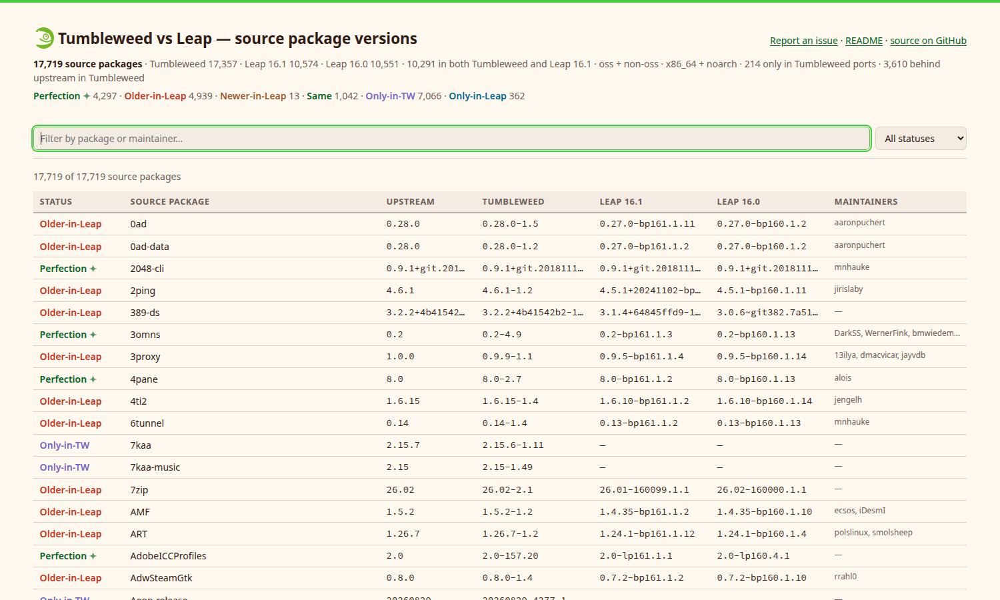

# 🦎 osdiff: openSUSE source package version diff

<!-- Badges -->

[](https://www.opensuse.org/)
[](https://opensuse.github.io/opensuse-version-diff/)
[](https://github.com/openSUSE/opensuse-version-diff/actions/workflows/pages.yml)


<p align="center">
  
</p>

Compares source package versions between openSUSE distributions (by default
Tumbleweed vs Leap 16.1) using the `ARCHIVES.gz` indexes published in every
repository, and adds maintainer information from PackageHub.

Further columns ride along read-only, newest first. The published page shows
**Upstream · Tumbleweed · Leap 16.1 · Leap 16.0**, picks up a future Leap on
its own (see [Extra columns](#-extra-columns)) and takes upstream versions from
[Repology](#-upstream-versions-from-repology).

Only **x86_64 and noarch** packages are considered. Tumbleweed's ARCHIVES index
covers no other arch, so counting Leap's `aarch64`/`ppc64le`/`s390x` packages
would only invent rows that look Leap-only.

```
./osdiff.py                      # full table
./osdiff.py | grep Older         # what Leap is behind on
./osdiff.py --only older         # same, done properly
./osdiff.py --format html -o diff.html   # interactive, local-repology-ish view
```

## 📦 Data sources

Both the **oss and non-oss** repositories of each distribution are read and
merged:

| What | Where | Local file |
| --- | --- | --- |
| Tumbleweed oss | `https://download.opensuse.org/tumbleweed/repo/oss/ARCHIVES.gz` | `ARCHIVES_TW` |
| Tumbleweed non-oss | `https://download.opensuse.org/tumbleweed/repo/non-oss/ARCHIVES.gz` | `ARCHIVES_TW_nonoss` |
| Leap 16.1 oss | `https://download.opensuse.org/distribution/leap/16.1/repo/oss/ARCHIVES.gz` | `ARCHIVES_161` |
| Leap 16.1 non-oss | `https://download.opensuse.org/distribution/leap/16.1/repo/non-oss/ARCHIVES.gz` | `ARCHIVES_161_nonoss` |
| Leap 16.0 oss | `https://download.opensuse.org/distribution/leap/16.0/repo/oss/ARCHIVES.gz` | `ARCHIVES_160` |
| Leap 16.0 non-oss | `https://download.opensuse.org/distribution/leap/16.0/repo/non-oss/ARCHIVES.gz` | `ARCHIVES_160_nonoss` |
| Maintainers | `https://src.opensuse.org/products/PackageHub.git` (`leap-16.1`) | `.packagehub/_maintainership.json` |
| Upstream | `https://repology.org/api/v1/projects/` (`--repology`) | `repology_newest.json` |

Only the two compared distributions are downloaded; Leap 16.0 costs nothing
until you ask for it with `--extra leap160`.

Missing inputs are fetched automatically: the ARCHIVES files over HTTP (and
decompressed), the maintainership data via a shallow sparse `git clone`, since git
avoids the bot check that guards the src.opensuse.org web interface. Everything
is reused on later runs, so re-runs take about two seconds.

Local copies are never re-downloaded unless you ask for it. `--refresh` issues
one HEAD request per repository and only pulls a file whose `Last-Modified` or
size actually changed, which keeps a scheduled rebuild at zero mirror traffic on
the days nothing moved. Requests carry a `User-Agent` naming this project so
download.opensuse.org admins can attribute (and complain about) the traffic.

non-oss contributes 31 source packages (`discord`, `opera`, `steam`, `unrar`,
`wine-mono`, …); the JSON export records per package which repository each side
came from, in `left_repos` / `right_repos` (and `extras[].repos`).

Maintainers are only known for the ~5.3k packages Leap gets from PackageHub;
the core packages inherited from SLES/Factory (release `160099.*`) and the
non-oss packages are not listed there and show up empty.

### 🏗️ Ports: the other architectures (`--ports`)

Only `x86_64` and `noarch` are read, because a package built for one Leap
architecture and not another is a build failure rather than a version
difference. Tumbleweed, though, keeps its non-x86_64 media in a separate tree
per port, and reading only x86_64 there gets two things wrong: a package
Tumbleweed *only* builds for aarch64 or s390x looks like it does not exist, and
if Leap ships it too the row reads `Only-in-Leap`, which is simply false.

`--ports` adds those trees as a **lookaside**, consulted only for names the
x86_64/noarch media do not have, so no version already on the page can be
changed by a port:

| Tree | URL | Serves |
| --- | --- | --- |
| `aarch64` | `https://download.opensuse.org/ports/aarch64/tumbleweed/repo/{oss,non-oss}/ARCHIVES.gz` | `aarch64`, `armv6hl`, `armv7hl` |
| `zsystems` | …`/ports/zsystems/`… | `s390x` |
| `ppc` | …`/ports/ppc/`… | `ppc64`, `ppc64le` |
| `riscv` | …`/ports/riscv/`… (no non-oss) | `riscv64` |
| `i586` | …`/ports/i586/`… | `i586`, `i686` |

Those five are the whole set: `/ports/armv6hl` and `/ports/armv7hl` redirect to
the aarch64 tree, so `--ports armv7hl,aarch64` is one download, not two. Any of
the architecture names in the right-hand column works as a shorthand, e.g.
`--ports s390x,ppc64le`; bare `--ports` takes all five.

It costs ~510 MB of downloads. Those indexes are ~9 GB uncompressed together,
so unlike the x86_64 ones they are streamed straight out of the gzip and never
expanded on disk; a full run takes about 15 seconds longer.

As of 2026-09-01 this adds **214 source packages** Tumbleweed has nowhere else:
187 new `Only-in-Tumbleweed` rows, the arch-specific packages (`yast2-s390`,
`libica`, `qclib`, `openssl-ibmca`, `u-boot-*`, the `cross-x86_64-gcc*` set),
and 27 rows that stop lying: `arm-trusted-firmware-*` and friends move from
`Only-in-Leap` to `Older-in-Leap` (Leap on 2.10.14, Tumbleweed's aarch64 tree on
2.12.8) or to `Same`. On the page such a row carries a small `ports` badge next
to the Tumbleweed version, with the architectures in its tooltip; the JSON
export puts them in `ports`, and `left_repos` names the tree
(`ports/zsystems oss`).

Leap's own ports are deliberately *not* read, because the lookaside exists to stop the
reference distro from looking emptier than it is, and doing the same for Leap
would invent `Only-in-Leap` rows instead of removing them.

## 🚦 Status column

Every row carries one greppable status. The first word is always the same, so
`grep Older` works no matter which distros are compared:

| Status | Meaning | On the page |
| --- | --- | --- |
| `Perfection` | level with Tumbleweed *and* with upstream | geeko green, bold, ✦ |
| `Older-in-Leap` | Leap is behind Tumbleweed | radish red |
| `Newer-in-Leap` | Leap is ahead | orange |
| `Same` | same as Tumbleweed, but something newer exists | geeko green |
| `Only-in-TW` | not in the compared Leap | plum purple |
| `Only-in-Leap` | not in Tumbleweed | blue |

`Perfection` is a subset of `Same` that only exists with
[`--repology`](#-upstream-versions-from-repology): both sides level *and*
Repology knows of nothing newer anywhere. Without an upstream column there is
no way to earn it, so the vocabulary stays at five rather than offering a
filter that can never match. It splits 5332 `Same` rows into 4290 genuinely
current and 1042 that merely match Tumbleweed, so `--only same` means
something sharper once upstream is in play, and `--only same --only perfect`
gets the old set back.

`Newer-in-Leap` is orange rather than red because it is a question, not a
failure: Leap being ahead of Tumbleweed is usually fine, but it is also what a
submission that skipped Factory first looks like, so those 13 rows are the ones
worth a look. Hovering any status on the page spells this out.

Extra columns do not get statuses of their own: one per side beats one per
release, and the version columns already say which Leap has what. So
`Only-in-Leap` covers a package any Leap column has, and `Only-in-TW` a package
the compared Leap lost even if an older one still ships it (33 packages are in
Tumbleweed and Leap 16.0 but were dropped in 16.1). Missing versions show a dash.

Only the **upstream version** is compared, not the release, because Leap and
Tumbleweed use unrelated release schemes (`bp161.1.2` vs `1.2`), so comparing
them would mark everything as different. Use `--with-release` to include it.
Comparison itself goes through rpm's own `labelCompare` when `python3-rpm` is
installed, with a built-in `rpmvercmp` as fallback.

## 🧮 Version schemes rpm gets wrong

`rpmvercmp` is a string algorithm: it has no idea what a version *means*, and
three scheme mismatches make it answer confidently and wrongly. All three are
rewritten **before comparing only**; the table always prints the version as
packaged, because a mis-versioned package is a bug worth seeing, not one to
paper over. Affected cells are <ins>underlined</ins> on the page and say what
they were compared as on hover; the JSON export carries a `normalized` object
per row, and the run prints a per-rule tally on stderr.

| Rule | Problem | Example |
| --- | --- | --- |
| `cpan-decimal` | CPAN's two notations for one release. perl reads the fraction in groups of three, so `1.111017` *is* `1.111.17`, and the two sort differently under rpm rules | `perl-CPAN-Mini` 1.111017 and 1.111.17, compared as the same version |
| `pre-release` | a pre-release marker glued on without the `~` that tells rpm it sorts *below* the release | `resource-agents` 4.18.0rc1 read as newer than 4.18.0 |
| `v-prefix` | a stray `v`, which rpm reads as an alpha segment, and alpha always loses to numeric | `dysk` v3.6.1 read as older than 2.9.1 |

That is 1012 of 17.7k rows, and it moves 128 verdicts: 115 rows that read
`Older-in-Leap` are in fact level and current (`Perfection`), and 13 of the 26
that read `Newer-in-Leap` were nothing of the kind: 7 are behind, 6 are level.
Nothing moves the other way.

Each rule is deliberately narrow, since one that fires where it should not
invents a difference nobody can explain. `pre-release` only matches between a
digit and a boundary, so it cannot hit a git hash or a longer word;
`cpan-decimal` is scoped to `perl-*`, because two-component versions are
ordinary elsewhere: `lua53-cliargs` 3.02 is 3.02, not perl's 3.20.0.
`test_osdiff.py` pins all of this down both ways:

```sh
python3 -m unittest -v test_osdiff
```

The 13 remaining `Newer-in-Leap` rows are genuine: Leap really does ship a
newer knot, yast2-bootloader, xdg-utils and so on, mostly from SLES.

## ➕ Extra columns

`--extra DISTRO` (repeatable) adds a distribution as a further version column
to the right of `--right`, newest first. An older Leap is the least
interesting column, so it lands furthest from the versions the diff is about:

```sh
./osdiff.py --extra leap160                    # Tumbleweed | Leap 16.1 | Leap 16.0
./osdiff.py --extra leap160 --format html -o diff.html
```

Extra columns are read-only annotations: only `--left` and `--right` are
compared. They do widen the row set, though, so a package that only survives in
an extra column is not silently lost: it shows up as `Only-in-Leap` with an
empty 16.1 cell (79 packages exist in Leap 16.0 but in neither Tumbleweed nor
Leap 16.1).

`--discover` HEAD-probes `download.opensuse.org` for the Leap releases this
script has no entry for (16.2 … 16.9) and adds every one that is already
published as an extra column. An unreleased version costs a single 404, so the
CI job runs with `--extra leap160 --discover` and the page will grow a Leap
16.2 column on the day that repository appears, with no commit needed here.

## 🔭 Upstream versions from Repology

`--repology` adds an **Upstream** column, left of `--left`, holding the newest
version [repology.org](https://repology.org/) has seen:

```sh
./osdiff.py --repology --extra leap160
```

Read the column for what it is: Repology's newest version across *every*
distribution it tracks, not a release feed of the project itself. It is an
excellent "somebody already packaged something newer" signal and a poor
citation for "upstream released X". 3610 Tumbleweed packages are behind it.

It also earns rows the [`Perfection`](#-status-column) status: Leap level with
Tumbleweed *and* nothing newer known anywhere. 4290 packages manage it.

Only the projects where Tumbleweed is *outdated* are downloaded
(`?inrepo=opensuse_tumbleweed&outdated=1`, ~17 pages of 200); for the rest
Repology by definition knows nothing newer than Tumbleweed, so Tumbleweed's own
version is the answer and no request is needed. That is ~115 MB instead of the
~400 MB a full crawl costs; the result is cached in `repology_newest.json`
(~100 kB) and only refetched once it is older than `--repology-max-age` days
(default 7, `0` forces it). Requests are one per second with the project's
`User-Agent`.

Packages Tumbleweed does not have get no upstream version, because the query is keyed
on Tumbleweed's `srcname`, which is also what makes the join exact and saves us
maintaining a package-name mapping.

### 🔮 Feeding Repology, later

Repology pulls; there is no upload API. Two things stand in the way today:

- **Leap 16 is not in Repology at all.** It tracks `opensuse_tumbleweed` and
  the multimedia/games/etc. devel projects, plus `opensuse_leap_15_5` and
  `15_6`, but nothing for 16.0 or 16.1. Adding them is a `repos.d/` YAML pull
  request against
  [repology-updater](https://github.com/repology/repology-updater).
- **Tumbleweed is at risk of removal.** Its
  [repository page](https://repology.org/repository/opensuse_tumbleweed)
  currently carries a banner: it "fails to provide actual links to package
  sources", "redirects to mirror blocked in Russia" and "provides intolerable
  amount of fake versions, violating Repology's requirements, and is thus
  subject to removal in the near future unless the problem is resolved".

Both are upstream-repology conversations rather than work for this tool, and
neither needs the diff to change shape.

## ⚙️ Options

```
--left/--right DISTRO   which distros to compare (tumbleweed, leap161, leap160)
--extra DISTRO          add a distro as an extra version column (repeatable)
--discover              probe for Leap releases not known yet and add them too
--repology              add an Upstream column from repology.org
--repology-max-age N    refetch that cache when older than N days (default 7)
--ports [TREES]         look up packages missing from the reference distro's
                        x86_64/noarch media in its ports trees (default: all)
--format FMT            table (default), md, csv, json, html
--only STATUS           filter by status substring, e.g. --only older (repeatable)
--grep REGEX            filter source package names
--maintainers           add a maintainers column to table/md/csv
--maintainer NAME       only packages maintained by NAME
--no-maintainers        skip loading maintainer data entirely
--with-release          compare the rpm release too
--refresh               re-check upstream for newer ARCHIVES indexes
-o FILE                 write output to FILE
-q                      no progress/summary on stderr
```

## 💡 Examples

```sh
# Everything you maintain, with the maintainer column shown
./osdiff.py --maintainer lkocman --maintainers

# ... or only the packages a maintainer has fallen behind on
./osdiff.py --maintainer lkocman --only older

# Python stack, as markdown for a report
./osdiff.py --only older --grep '^python-' --format md -o python.md

# Include what Tumbleweed only builds for s390x and aarch64, rather than
# reporting it as missing
./osdiff.py --ports s390x,aarch64

# Full dataset for further processing
./osdiff.py --format json -o diff.json
```

## 📊 Current numbers (Tumbleweed vs Leap 16.1, oss + non-oss, x86_64 + noarch)

Run with `--extra leap160 --repology --ports`: 17719 source packages in total:
17357 in Tumbleweed (214 of them only in a ports tree), 10574 in Leap 16.1 and
10551 in Leap 16.0, of which 10291 exist in both compared distros, and 3610 are
behind upstream in Tumbleweed:

| Status | Count | Without `--ports` |
| --- | --- | --- |
| Perfection | 4297 | 4290 |
| Older-in-Leap | 4939 | 4919 |
| Newer-in-Leap | 13 | 13 |
| Same | 1042 | 1042 |
| Only-in-TW | 7066 | 6879 |
| Only-in-Leap | 362 | 389 |

The JSON export carries the same figures under `totals` and `summary`.

## 🚀 Publishing to GitHub Pages

`.github/workflows/pages.yml` regenerates the site and deploys it every morning
(05:17 UTC), on every push to `main`, and on demand via *Run workflow*. It needs
no secrets and no dependencies. The runner has no `python3-rpm`, so osdiff uses
its built-in `rpmvercmp`, which is verified to agree with rpm's `labelCompare`
on every package in the current data set.

One-time setup after pushing: in the repository's **Settings**, open **Pages**
and set **Source** to **GitHub Actions**. Nothing else is needed; the workflow
builds the page and uploads it itself, so there is no `gh-pages` branch and no
generated file in git.

The deployed site contains:

| Path | What |
| --- | --- |
| [`index.html`](https://opensuse.github.io/opensuse-version-diff/) | the interactive table (self-contained, ~2 MB) |
| [`diff.json`](https://opensuse.github.io/opensuse-version-diff/diff.json) / [`diff.json.gz`](https://opensuse.github.io/opensuse-version-diff/diff.json.gz) | full data set including per-package repos and arches |
| [`diff.csv`](https://opensuse.github.io/opensuse-version-diff/diff.csv) | flat table with maintainers |

The ARCHIVES indexes are never committed, since `.gitignore` keeps them out. CI
caches the compressed ones between runs and passes `--refresh`, so a scheduled
rebuild normally costs fifteen HEAD requests for the indexes plus eight for
`--discover`, and downloads only what changed upstream. A cold cache pulls
~870 MB, ~510 MB of which is the nine ports indexes; those are the part that
actually moves most days, so drop `--ports` from `OSDIFF_COLUMNS` if that
traffic ever becomes a problem. The Repology cache rides along in the same cache
entry, which is what keeps that fetch weekly rather than nightly.

## 🔗 Links

| Where | What |
| --- | --- |
| 🌐 [Live version diff](https://opensuse.github.io/opensuse-version-diff/) | the interactive table, rebuilt every morning |
| 📦 [diff.json](https://opensuse.github.io/opensuse-version-diff/diff.json) | the full data set, per-package repos and arches included |
| 📄 [diff.csv](https://opensuse.github.io/opensuse-version-diff/diff.csv) | the flat table, with maintainers |
| 🚦 [Workflow runs](https://github.com/openSUSE/opensuse-version-diff/actions/workflows/pages.yml) | what the last rebuild did, and its logs |
| 🐛 [Issues](https://github.com/openSUSE/opensuse-version-diff/issues) | a wrong version, a missing package, an idea |
| 🔭 [Repology](https://repology.org/repository/opensuse_tumbleweed) | where the Upstream column comes from |
| 🦎 [PackageHub](https://src.opensuse.org/products/PackageHub) | where the maintainer names come from |

Thanks for your contribution! 🐲💚

## 🍻 openSUSE Bar

[](https://meet.opensuse.org/bar)
[](https://en.opensuse.org/Code_of_Conduct)

This project is developed mostly at the [openSUSE Bar](https://en.opensuse.org/openSUSE:Bar) a place where everyone from the community can hang out, meet new people and just have a good time. We fix stuff together, contribute, talk about basically everything, help others and have a lot of fun.

The openSUSE Bar operates under the [openSUSE Code of Conduct](https://en.opensuse.org/Code_of_Conduct).